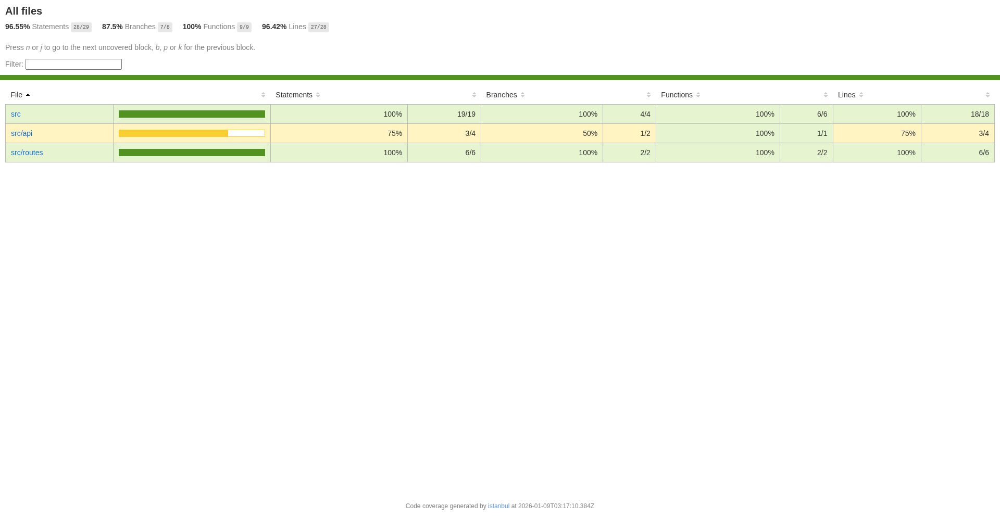

# Testing

## Notes

## Setting Up Testing Environment
- We use Vitest as our testing framework, which is a Vite-native test runner. happy-dom is used as the testing environment.
```bash
pnpm install -D vitest @testing-library/react happy-dom
```
- we configured test environment in `vite.config.js`:
```js
...
  test: {
    environment: 'happy-dom',
  }
...
``` 
## Writing Tests on Pizza Component
- We create a test file `src/__tests__/Pizza.test.jsx` to test the `Pizza` component.
- as long as it's on the `__tests__` folder or has `.test.jsx` suffix, Vitest will automatically pick it up as a test file.
```jsx
test("alt text renders on image", async () => {
  const name = "My Favorite Pizza";
  const src = "https://picsum.photos/200";
  const screen = render(
    <Pizza name={name} description="super cool pizza" image={src} />
  );

  const img = screen.getByRole("img");
  expect(img.src).toBe(src);
  expect(img.alt).toBe(name);
}); 
```
## Clean Up After Each Test
- We use `afterEach(cleanup);` to ensure that the DOM is cleaned up after each test, preventing tests from affecting each other.
```jsx
import { render, cleanup } from "@testing-library/react";
import { afterEach } from "vitest";

afterEach(cleanup);
```
- Either we can call `cleanup` manually after each test or use `afterEach(cleanup);` to automate it.

## Additional Test for Default Image on Pizza Component
- We added another test to check if the `Pizza` component uses a default image when no image prop is provided.
```jsx
test("to have default image if none is provided", async () => {
  const screen = render(
    <Pizza name={"Cool Pizza"} description="super cool pizza" />
  );

  const img = screen.getByRole("img");
  expect(img.src).not.toBe("");
});
```
- we should also update the `Pizza` component to handle the case where no image prop is provided:
```jsx
 
```
- Everything should work from now

## Mocking (Testing contact page)
- First we need a helper function `vitest-fetch-mock` to mock the fetch API in our tests.
```bash
pnpm install -D vitest-fetch-mock
```
- In our test file `src/__tests__/contact.lazy.node.test.jsx`, we set up the fetch mocker:
```jsx
const queryClient = new QueryClient();

const fetchMocker = createFetchMock(vi);
fetchMocker.enableMocks();

test("can submit contact form", async () => {
  fetchMocker.mockResponse(JSON.stringify({ status: "ok" }));
  const screen = render(
    <QueryClientProvider client={queryClient}>
      <Route.options.component />
    </QueryClientProvider>
  );

  const nameInput = screen.getByPlaceholderText("Name");
  const emailInput = screen.getByPlaceholderText("Email");
  const msgTextArea = screen.getByPlaceholderText("Message");

  const testData = {
    name: "Brian",
    email: "test@example.com",
    message: "This is a test message",
  };

  nameInput.value = testData.name;
  emailInput.value = testData.email;
  msgTextArea.value = testData.message;

  const btn = screen.getByRole("button");

  btn.click();

  const h3 = await screen.findByRole("heading", { level: 3 });

  expect(h3.innerText).toContain("Submitted");

  const requests = fetchMocker.requests();
  expect(requests.length).toBe(1);
  expect(requests[0].url).toBe("http://localhost:3000/api/contact");
  expect(fetchMocker).toHaveBeenCalledWith("/api/contact", {
    body: JSON.stringify(testData),
    headers: {
      "Content-Type": "application/json",
    },
    method: "POST",
  });
});
```
- The `vi` is Vitest's spy library. 
- `vitest-fetch-mock` is just a nice layer on top of vi. We could just use `vi.spyOn(global, 'fetch')` directly if we wanted to.

## Custom Hook Testing (usePizzaOfTheDay)
- First we test the hook with a fake component before using `renderHook` from `@testing-library/react`.
```jsx
function getPizzaOfTheDay() {
  let pizza;

  function TestComponent() {
    pizza = usePizzaOfTheDay();
    return null;
  }

  render(<TestComponent />);

  return pizza;
}

test("gives null when first called", async () => {
  fetch.mockResponseOnce(JSON.stringify(testPizza));
  const pizza = getPizzaOfTheDay();
  expect(pizza).toBeNull();
});
```
- Then instead of writing a fake component, we can use `renderHook` to test the hook directly.
```jsx
test("to be null on initial load", async () => {
  fetch.mockResponseOnce(JSON.stringify(testPizza));
  const { result } = renderHook(() => usePizzaOfTheDay(""));
  expect(result.current).toBeNull();
});
```
- In addition, we add another test to check the API calls instead of just null cheking.
```jsx
test("to call the API and give back the pizza of the day", async () => {
  fetch.mockResponseOnce(JSON.stringify(testPizza));
  const { result } = renderHook(() => usePizzaOfTheDay(""));
  await waitFor(() => {
    expect(result.current).toEqual(testPizza);
  });
  expect(fetchMocker).toBeCalledWith("/api/pizza-of-the-day");
});
```
- As we can see, we use `waitFor` to wait for the asynchronous update of the hook's state before making assertions. So the test will wait until the pizza data is fetched and the state is updated before checking the result.

## Snapshot Testing
- Vitest creates snapshot files automatically when we run tests with snapshot assertions for the first time.
- We can see it's just rendering out what it would look like on `__snapshots__` folder.
- Some people don't find it useful. Just in case, some times they can be helpful.
- Here is an example of snapshot testing for a `Cart` component when the cart is empty:
```jsx
test("snapshot with nothing in cart", () => {
  const { asFragment } = render(<Cart cart={[]} />);
  expect(asFragment()).toMatchSnapshot();
});
```
- And another example when the cart has items:
```jsx

test("snapshot with some stuff in cart", () => {
  const { asFragment } = render(
    <Cart
      cart={[
        {
          pizza: {
            id: "pepperoni",
            name: "The Pepperoni Pizza",
            category: "Classic",
            description: "Mozzarella Cheese, Pepperoni",
            image: "/public/pizzas/pepperoni.webp",
            sizes: {
              S: 9.75,
              M: 12.5,
              L: 15.25,
            },
          },
          size: "M",
          price: "$12.50",
        },
        {
          pizza: {
            id: "ckn_pesto",
            name: "The Chicken Pesto Pizza",
            category: "Chicken",
            description:
              "Chicken, Tomatoes, Red Peppers, Spinach, Garlic, Pesto Sauce",
            image: "/public/pizzas/ckn_pesto.webp",
            sizes: {
              S: 12.75,
              M: 16.75,
              L: 20.75,
            },
          },
          size: "L",
          price: "$20.75",
        },
        {
          pizza: {
            id: "bbq_ckn",
            name: "The Barbecue Chicken Pizza",
            category: "Chicken",
            description:
              "Barbecued Chicken, Red Peppers, Green Peppers, Tomatoes, Red Onions, Barbecue Sauce",
            image: "/public/pizzas/bbq_ckn.webp",
            sizes: {
              S: 12.75,
              M: 16.75,
              L: 20.75,
            },
          },
          size: "S",
          price: "$12.75",
        },
      ]}
    />
  );
  expect(asFragment()).toMatchSnapshot();
});
```
- If we look at the snapshot, it's rendering Pizza components as well. Now if we modify `Pizza.jsx` (that has its own tests already) your `Cart.jsx` test is going to fail. This is misleading, nothing is wrong or different with `Cart.jsx`. 
- Update the snapshot by either running `npm run test -- -u` or you can use the watcher to do it with either `u` to update all at once or `i` one-by-one.
- We should commit this snapshot to the git.

## Coverage Report
- We use v8 from vitest as the coverage reporter in our `vite.config.js`:
```js
  test: {
    environment: 'happy-dom',
    coverage: {
      reporter: ['text', 'json', 'html'],
    }
  },
```
- Here is the coverage report example after running `pnpm run coverage`:
File                   | % Stmts | % Branch | % Funcs | % Lines | Uncovered Line #s 
-----------------------|---------|----------|---------|---------|-------------------
All files              |   96.55 |     87.5 |     100 |   96.42 |                   
 src                   |     100 |      100 |     100 |     100 |                   
  Cart.jsx             |     100 |      100 |     100 |     100 |                   
  Pizza.jsx            |     100 |      100 |     100 |     100 |                   
  usePizzaOfTheDay.jsx |     100 |      100 |     100 |     100 |                   
 src/api               |      75 |       50 |     100 |      75 |                   
  postContact.js       |      75 |       50 |     100 |      75 | 11                
 src/routes            |     100 |      100 |     100 |     100 |                   
  contact.lazy.jsx     |     100 |      100 |     100 |     100 |                   

- We can see that result in html format in `coverage/index.html` after running the coverage command.

- We can see which lines are not covered in the report. In this case, line 11 in `postContact.js` is not covered.

## Vitest UI
- It's just the another way to test our code with a nice UI from the browser.
- We just need to add : 
```bash
pnpm add -D @vitest/ui
```
- And add `package.json` script:
```json
"test:ui": "vitest --ui"
```
- Then run the command:
```bash
pnpm run test:ui
```
- It should pop up the browser automatically with the Vitest UI open.

## Browser Test
- Browser tests run in a real browser environment (using Playwright) instead of a simulated DOM like happy-dom.
- This is useful for testing actual browser behavior, user interactions, and ensuring components work correctly in real browsers.

### Setting Up Browser Testing
- First, install the necessary dependencies:
```bash
pnpm add -D @vitest/browser vitest-browser-react playwright
```

### Configuring Vitest Workspace
- We use `vitest.workspace.js` to configure separate test environments for Node tests (happy-dom) and browser tests (Playwright).
```js
import { defineWorkspace } from "vitest/config";
import react from '@vitejs/plugin-react';
import { tanstackRouter } from '@tanstack/router-plugin/vite';

export default defineWorkspace([
  {
    test: {
      include: ["**/*.node.test.{js,jsx}"],
      exclude: ["**/*.browser.test.{js,jsx}"],
      name: "happy-dom",
      environment: "happy-dom",
    },
    plugins: [tanstackRouter(), react()],
  },
  {
    test: {
      setupFiles: ["vitest-browser-react"],
      include: ["**/*.browser.test.{js,jsx}"],
      name: "browser",
      browser: {
        provider: "playwright",
        enabled: true,
        name: "chromium",
      },
    },
    plugins: [tanstackRouter(), react()],
  },
]);
```
- The first configuration is for node tests (happy-dom environment) with `*.node.test.jsx` naming pattern.
- The second configuration is for browser tests using Playwright with `*.browser.test.jsx` naming pattern.

### Writing Browser Tests
- Browser tests use `vitest-browser-react` for rendering instead of `@testing-library/react`.
- Example test file `src/__tests__/Pizza.browser.test.jsx`:
```jsx
import { render } from "vitest-browser-react";
import { expect, test } from "vitest";
import Pizza from "../Pizza";

test("alt text renders on image", async () => {
  const name = "My Favorite Pizza";
  const src = "https://picsum.photos/200";
  const screen = render(
    <Pizza name={name} description="super cool pizza" image={src} />
  );

  const img = await screen.getByRole("img");

  await expect.element(img).toBeInTheDocument();
  await expect.element(img).toHaveAttribute("src", src);
  await expect.element(img).toHaveAttribute("alt", name);
});
```
- Key differences from node tests:
  - Import `render` from `vitest-browser-react` instead of `@testing-library/react`
  - Use `await` for `getByRole` and other queries since they're asynchronous in browser mode
  - Use `expect.element()` instead of plain `expect()` for DOM assertions
  - All assertions are async and need `await`

### Running Browser Tests
- Browser tests run automatically when you run `pnpm test` (Vitest will run both workspaces).
- You can also run only browser tests by filtering: `pnpm test --project=browser`
- Or run only node tests: `pnpm test --project=happy-dom`
- Playwright will launch a real Chromium browser in the background to execute the tests. 
